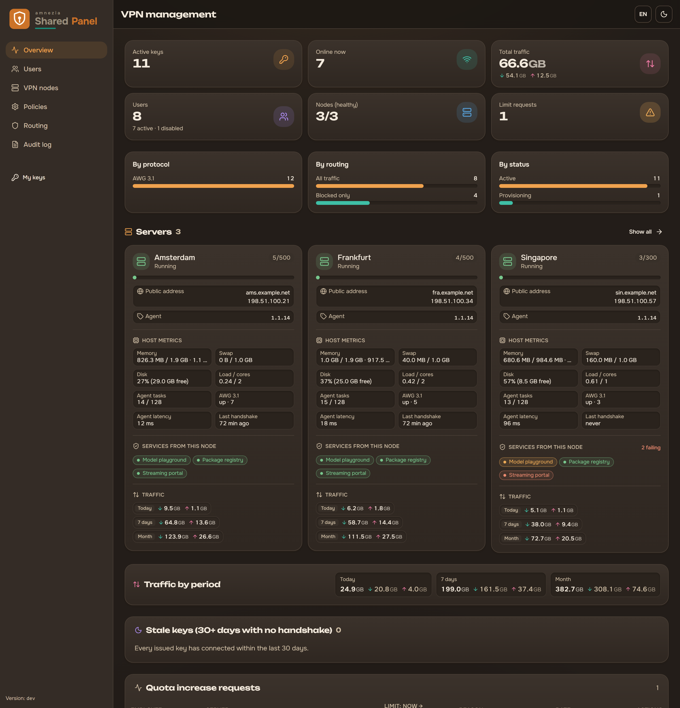
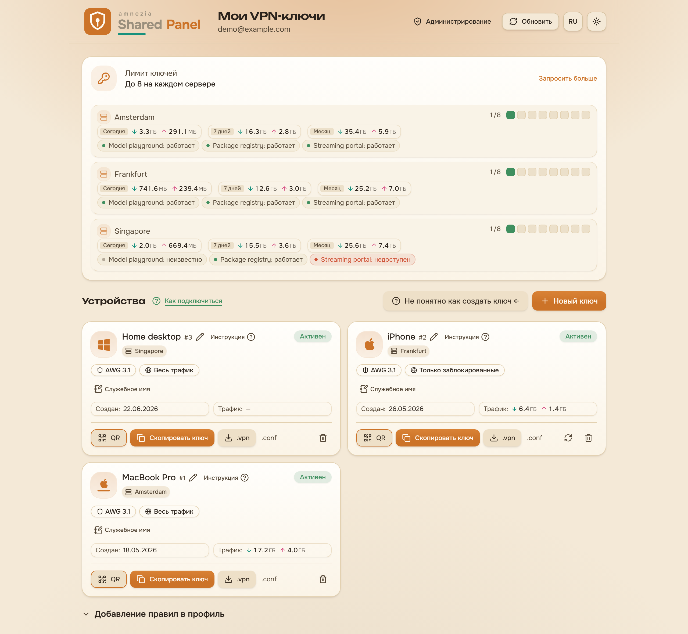
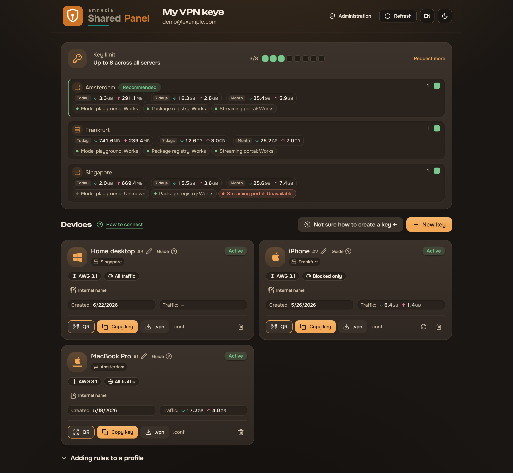
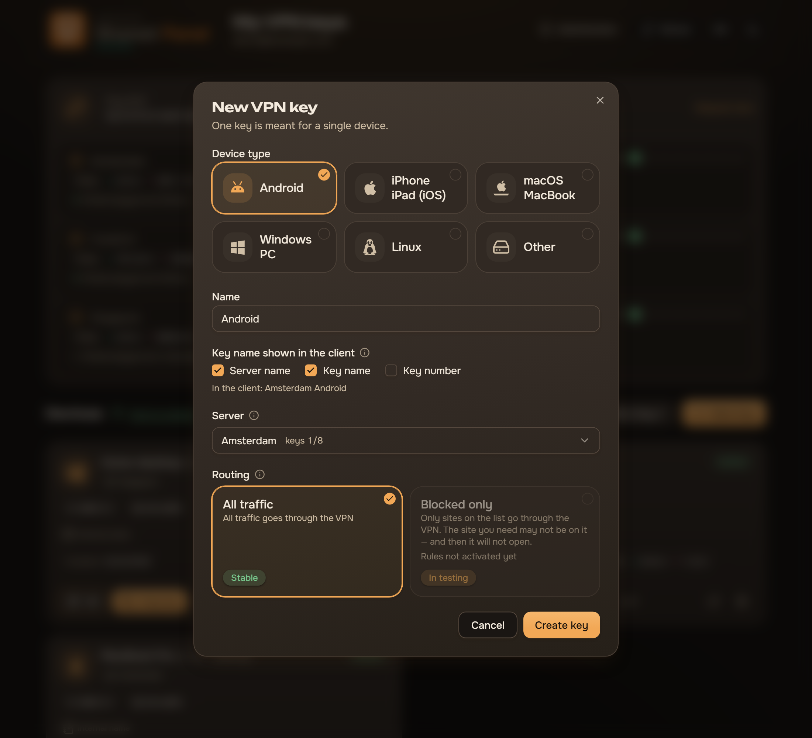

<div align="center">


**A self-hosted control plane for AmneziaWG VPN access.**
Employees create and manage their own device keys; admins manage users, nodes,
policy, and telemetry across one or more nodes — behind a login you control.

[](https://github.com/wyrtensi/amnezia-shared-panel/actions/workflows/ci.yml)
[](https://github.com/wyrtensi/amnezia-shared-panel/releases)
[](LICENSE)
[](#protocol)
[](https://nextjs.org)

</div>

## Overview

Handing out VPN configs by hand doesn't scale: every new device is a manual step,
revoking a departed teammate is fiddly, and nobody can see who's using what. Shared
Panel replaces that with self-service. A team member signs in, creates a key for a
specific device, and downloads a config or QR; an administrator sees every user,
their keys, traffic, and who's online, and can raise or cut limits or offboard
someone in a click.

The constraint it's built around: **the panel has to open even where the usual
front door is blocked.** Some people can't reach Cloudflare, and sometimes the VPN
itself isn't up yet — which is exactly when you need to get into the panel to fetch
a config. So sign-in works two independent ways at once — Cloudflare Access, and the
panel's own Google login on a direct, Cloudflare-free domain (see below).

Under the hood it's two halves that deploy independently. The **panel** — a Next.js
web app, a Fastify API, a worker, and Postgres — manages users, policy, and
telemetry and drives the nodes. A **node** is a VPN server running AmneziaWG 3.1
(which masks packet headers and adds random trailers, so the traffic is harder to
fingerprint and block) with a small agent the panel talks to. One panel, one or
more nodes, each updated on its own.

## What it looks like

**Administration** — one overview with the numbers that matter, per-node capacity
and traffic, stale accounts, pending quota requests, and a one-click panel update.

<p align="center">
  
</p>

**A team member's own page** — their devices, what each key routes, how much of
their quota is left, and the extra routes they may layer on top. Below it is the
same screen twice: the UI ships English and Russian, follows the browser language
on first visit (the RU/EN switch is remembered afterwards) and the system theme.

<table>
  <tr>
    <td width="50%"></td>
    <td width="50%"></td>
  </tr>
</table>

**Creating a key** takes one dialog: pick the device, name it, choose what the
AmneziaVPN client will show as the connection title, and pick how traffic is
routed. The preview under the checkboxes is built with the same function the API
uses at export time, so it cannot drift from the name the client actually gets.

**Connecting** is explained in the panel itself: the "How to connect" button in
the keys page header opens a guide that installs the AmneziaVPN client. It is
organised around one choice: the reader picks their device — Windows/macOS/Linux,
Android, or iPhone / iPad — and gets only that instruction, rather than scrolling
past advice for platforms they do not have. Each one walks through pasting a key, explains how to import a `.conf`
file — the easier route for split-tunnel profiles on a computer and on Android —
and lists what to try when a connection fails. It also states the one platform
difference we know of: on iPhone and iPad a key with a routing profile connects
but applies none of its rules — verified with both the pasted key and the `.conf`
file — so the guide tells them to use a key without a profile. For the same
reason the "New key" wizard greys out the routing profiles once you pick
iPhone / iPad, with the reason shown on the card, and a key that already has that
combination carries a warning and a muted profile badge on its card;
`amnezia-panel user-create-key --device-type=ios` prints the same warning. This
is a stop-gap that makes the limitation visible, not a decision that iOS will
never support routing profiles. The download links are not hardcoded:
`GET /api/client-releases` resolves the newest `amnezia-client` release on the
panel host, caches it for six hours, and falls back to version-free release-page
links when GitHub is unreachable, so a user on a network that cannot reach GitHub
still gets working buttons. The AmneziaWG 3.1 client floor is a single constant
in `packages/contracts`. Operators can inspect and force-refresh what the panel
resolves with `amnezia-panel client-releases [--refresh]` (see `docs/CLI.md`).

<p align="center">
  
</p>

## Protocol

**This project targets AmneziaWG 3.1 as its primary protocol.** New nodes and new
keys should use AWG 3.1 (header protection, ranged headers, random trailers).
AmneziaWG 2.0 is retained only for backward compatibility with already-deployed
nodes and existing peers during the transition; do not build new features against
2.0. AWG 3.1 keys require the official AmneziaVPN client 5.0.1.5 or newer.

## Two ways users sign in

The panel is usable even where a working VPN or Cloudflare is unavailable — it
accepts either identity, side by side:

- **Cloudflare Access** — the edge injects a signed JWT the control-api verifies
  (Google Workspace as the IdP, an email/group allowlist at the edge).
- **Direct server-side Google** — for users who cannot reach Cloudflare, the panel
  serves itself on a DNS-only host with its **own** Google login and a signed
  session. See [`docs/INSTALL.md` §3.5](docs/INSTALL.md).

Roles live in the panel (`admin` / `user`); an admin is also a user (own keys and
quota) and is pinned so it can never lock itself out.

## Workspace

- `apps/web` — employee and administrator web interface (Next.js).
- `apps/control-api` — authenticated central REST API (Fastify).
- `apps/worker` — provisioning, telemetry, retention, and routing jobs.
- `apps/cli` — admin CLI over the control-api ([`apps/cli/README.md`](apps/cli/README.md)).
- `packages/contracts` — shared public types and validation schemas.
- `packages/db` — PostgreSQL schema, migrations, and repositories.
- `services/node-agent` — reviewed fork of `kyoresuas/amnezia-api`; the HTTP agent
  that fronts an AmneziaWG container on each node.
- `infra/dev` — local Docker Compose environment.
- `infra/prod` — production Compose stack (tiny-host, pulls the image from GHCR).
- `infra/node` — VPN-node deployment assets.

Sensitive local material belongs in the git-ignored `secrets/` directory.

## Quick start (local dev)

```bash
pnpm install
cd infra/dev && docker compose --env-file .env up --build
```

The app comes up at `http://127.0.0.1:3000`. The dev stack sets a dev identity
(`DEV_USER_EMAIL`, default `admin@example.com`) so you sign in without Cloudflare
or Google. To run the services in watch mode without containers: `pnpm dev`.

Before pushing, run what CI runs: `pnpm lint && pnpm typecheck && pnpm build &&
pnpm test`. Full command reference: **[`docs/CLI.md`](docs/CLI.md)**.

## Deploy & update (production)

The live host runs `infra/prod` and **pulls** the published image
`ghcr.io/<owner>/amnezia-shared-panel:latest`. Cutting a release = tag the public
repo `vX.Y.Z`; CI builds and pushes the image (the tag is stamped into
`GET /api/admin/version`). On the host, `bash infra/prod/update.sh` performs a
data-safe update (backup DB → pull → migrate → recreate; volumes untouched), and
the **Administration → Overview → Update** button does the same via a host systemd
worker after a one-time `sudo bash infra/prod/install-updater.sh`.

## Documentation

- **[`docs/INSTALL.md`](docs/INSTALL.md) — start here.** Install guide written for
  a human or an AI agent: what to decide first, then node + panel + public access
  (Cloudflare Access with Google Workspace, and the optional direct Google login),
  the temporary→least-privilege API-token hand-off, and the admin/user policy split.
- [`docs/CLI.md`](docs/CLI.md) — every command for the panel **and** a node
  (dev, build, database, deploy/update, backup, admin CLI; AmneziaWG/awg, Docker,
  node-agent, health).
- [`docs/HOSTING.md`](docs/HOSTING.md) — architecture, identity model, credential
  types, secrets, end-to-end hosting.
- [`docs/AGENT-HOST-SETUP.md`](docs/AGENT-HOST-SETUP.md) — install a fresh AWG host
  and wire it to the panel.
- [`docs/NODE-CONNECT.md`](docs/NODE-CONNECT.md) — register and reach a live node
  (SSH tunnel or direct TLS) and its safety constraints. `scripts/add-node.sh`
  does the whole rollout — bare host to registered node — in one command.
- [`docs/CLOUDFLARE-SETUP.md`](docs/CLOUDFLARE-SETUP.md) / [`docs/CLOUDFLARE-ACCESS.md`](docs/CLOUDFLARE-ACCESS.md)
  — the tunnel + Google login, and the Access app / allowlist / two-way sync.
- [`docs/DEPLOY-UPDATE.md`](docs/DEPLOY-UPDATE.md) · [`docs/UPDATE-MECHANISM.md`](docs/UPDATE-MECHANISM.md)
  — updating the stack from git, and the in-panel Update button internals.

## License

Released under the MIT License — see [`LICENSE`](LICENSE).

`services/node-agent` is a fork of
[`kyoresuas/amnezia-api`](https://github.com/kyoresuas/amnezia-api) (MIT), and the
project builds on the AmneziaWG / Amnezia VPN ecosystem. Third-party attributions
and the licenses of notable dependencies are listed in [`NOTICE.md`](NOTICE.md).
