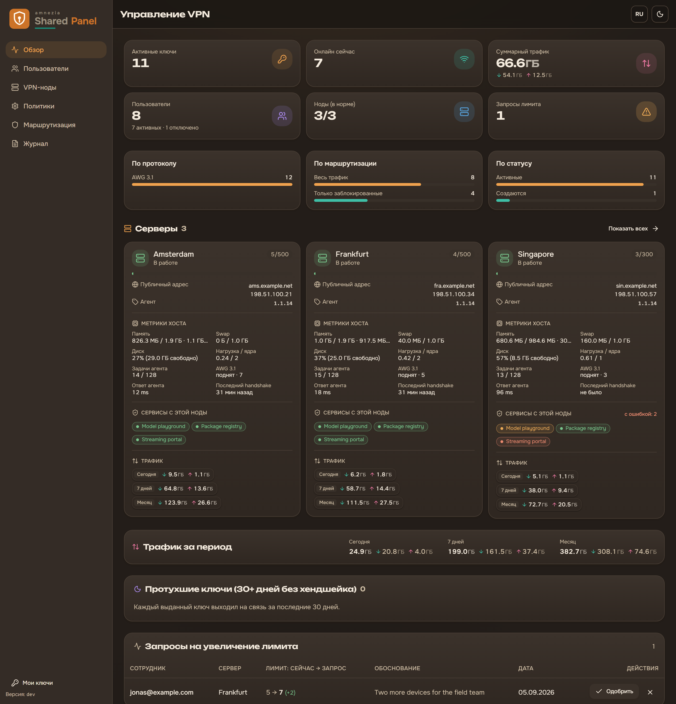
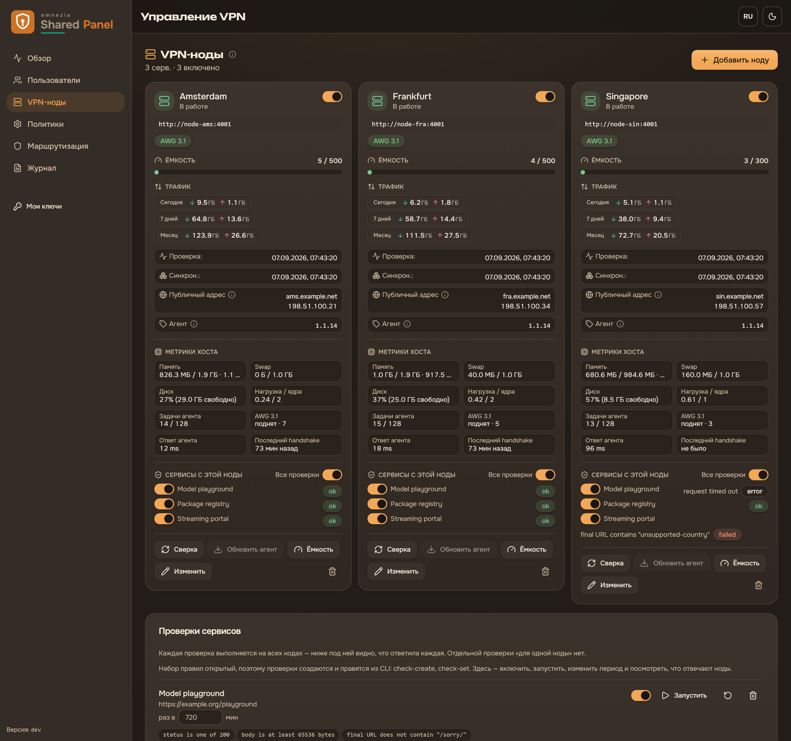
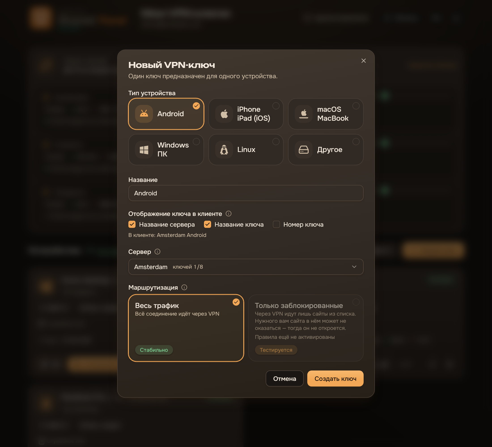
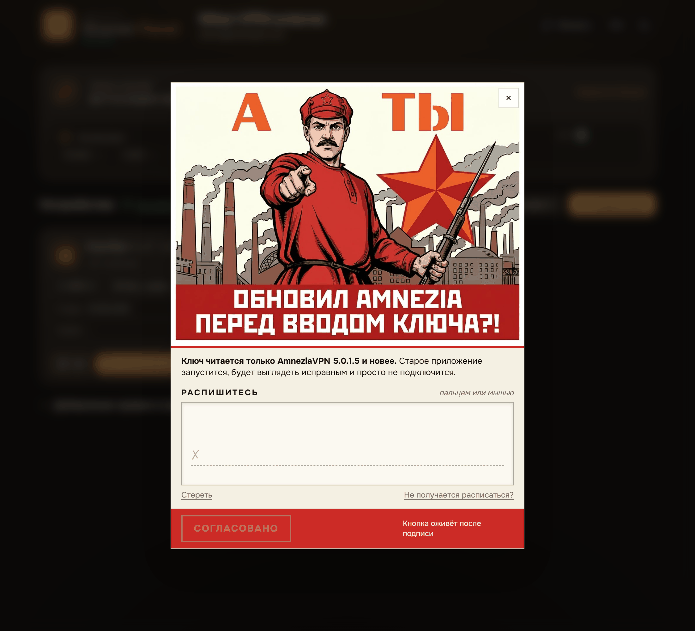

<div align="center">


**Самостоятельная панель управления доступом к VPN на AmneziaWG.**
Сотрудники сами заводят ключи для своих устройств; администратор ведёт
пользователей, ноды, политики и телеметрию — за входом, который вы контролируете.

[English](README.md) · **Русский**

[](https://github.com/wyrtensi/amnezia-shared-panel/actions/workflows/ci.yml)
[](https://github.com/wyrtensi/amnezia-shared-panel/releases)
[](https://github.com/wyrtensi/amnezia-shared-panel/releases)
[](https://t.me/+ACFiuWoI9Es2OGZi)
[](LICENSE)
[](#протокол)
[](https://nextjs.org)

</div>

## О проекте

Раздавать конфиги руками не масштабируется: каждое новое устройство — ручной шаг,
отзыв у ушедшего коллеги делается на ощупь, и никто не видит, кто чем пользуется.
Shared Panel заменяет это самообслуживанием. Сотрудник входит, заводит ключ под
конкретное устройство и скачивает конфиг или QR; администратор видит всех
пользователей, их ключи, трафик и кто сейчас онлайн, может поднять или срезать
лимит, отключить человека в одно нажатие.

Ограничение, вокруг которого всё построено: **панель должна открываться и тогда,
когда обычная дверь закрыта.** Кто-то не дотягивается до Cloudflare, а иногда сам
VPN ещё не поднят — и это ровно тот момент, когда в панель нужно попасть за
конфигом. Поэтому вход работает двумя независимыми способами сразу: через
Cloudflare Access и через собственный вход по Google на прямом домене без
Cloudflare.

Внутри — две половины, которые обновляются независимо. **Панель** (веб на Next.js,
API на Fastify, воркер и Postgres) ведёт пользователей, политики и телеметрию и
управляет нодами. **Нода** — это VPN-сервер с AmneziaWG 3.1, который маскирует
заголовки пакетов и добавляет случайные трейлеры, так что трафик труднее
опознать и заблокировать, плюс небольшой агент, с которым разговаривает панель.
Одна панель, одна или несколько нод, каждая обновляется сама по себе.

Что это даёт на практике:

- **Ключи без посредника.** Пользователь выбирает устройство и сервер, получает
  конфиг, файл `.conf` или QR-код, может переименовать ключ или перевыпустить его,
  никого не спрашивая. Лимиты — по серверу или общим пулом, для одного человека
  или для всей панели.
- **Маршрутизация на каждый ключ.** Весь трафик в туннель или только то, что
  числится заблокированным — профиль «только заблокированные» держит весь свой
  список внутри ключа, поэтому такой ключ передаётся файлом, а не ссылкой или
  QR-кодом. Списки правил панель забирает, проверяет и версионирует
  сама — поэтому ключ умеет сказать владельцу, что маршруты, с которыми он был
  выгружен, с тех пор изменились. Встроенные источники — те самые общедоступные
  списки блокировок, вокруг которых проект и вырос; `RULE_FEEDS` перенаправляет их
  на любой другой список.
- **Проверки сервисов.** Именованные проверки — код ответа, маркер в теле, куда
  привёл редирект — выполняются с каждой ноды по расписанию. Вопрос «открывается ли
  это оттуда» становится строкой в панели, а не экспериментом.
- **Видно весь парк.** Метрики хоста, версия агента, число пиров и трафик по нодам
  и по ключам, плюс обновление агента одной командой: меняется только контейнер
  агента, ни один туннель не перезапускается.
- **Отключение, доведённое до конца.** Отключение учётной записи отзывает её ключи
  на нодах, а удалить строку, за которой ещё может стоять живой пир, панель просто
  не даст — после ушедшего коллеги не остаётся забытых пиров.

## Как это выглядит

**Администрирование** — один обзор с цифрами, которые важны: занятость и трафик по
нодам, протухшие учётные записи, заявки на увеличение лимита и обновление панели в одно
нажатие.

<p align="center">
  
</p>

**Серверы** — каждая нода с тем, что она на самом деле делает: версия агента,
метрики хоста, снятые с машины, а не с её контейнера, подняты ли интерфейсы
AmneziaWG и сколько пиров несут, и вердикт каждой проверки сервисов с этой ноды.
Проверки идут со всех нод, поэтому сервис, который отвечает в Амстердаме и
отказывает в Сингапуре, виден как разница между нодами, а не как обращение в
поддержку.

<p align="center">
  
</p>

**Страница сотрудника** — его устройства, что маршрутизирует каждый ключ, сколько
осталось от лимита на каждом сервере и какие дополнительные маршруты он может
добавить. Ниже один и тот же экран дважды: интерфейс есть на русском и английском,
при первом заходе следует языку браузера (потом переключатель RU/EN запоминается)
и системной теме.

<table>
  <tr>
    <td width="50%"></td>
    <td width="50%"></td>
  </tr>
</table>

**Создание ключа** — один диалог: выбрать устройство, назвать его, решить, что
клиент AmneziaVPN покажет заголовком подключения, и выбрать маршрутизацию.
Предпросмотр под галочками собирается той же функцией, которой API пользуется при
выгрузке, поэтому он не может разойтись с именем, которое реально получит клиент.

<p align="center">
  
</p>

**Как подключиться** объясняет сама панель: кнопка в заголовке страницы ключей
открывает инструкцию по установке клиента AmneziaVPN. Она построена вокруг одного
выбора: читатель указывает своё устройство — Windows/macOS/Linux, Android или
iPhone / iPad — и получает только свою инструкцию, а не пролистывает советы для
платформ, которых у него нет. Каждая проводит через вставку ключа, объясняет импорт
файла `.conf` (на компьютере и на Android это проще для профилей с раздельным
туннелем) и перечисляет, что попробовать, если соединение не встаёт. Там же назван
единственный известный нам разрыв между платформами: на iPhone и iPad ключ с
профилем маршрутизации подключается, но правил не применяет — проверено и вставкой
ключа, и файлом `.conf`, — поэтому инструкция советует брать ключ без профиля. По
той же причине мастер создания ключа гасит профили маршрутизации, как только выбран
iPhone / iPad, и пишет причину прямо на карточке, а уже существующий такой ключ
несёт предупреждение и приглушённый бейдж профиля.

**Устаревший клиент — самая частая поломка**, и молчаливая: AmneziaVPN старее
порога AWG 3.1 запускается, выглядит исправным и просто не подключается, а
человек делает вывод, что сломалась панель. На это отвечают два шага. Первый
срабатывает один раз, сразу после создания ключа. Второй — плакат ниже: первые
два раза, когда обычный пользователь берёт готовый ключ (QR, копирование, любой
файл конфигурации), панель останавливает его и просит **расписаться**, что
приложение обновлено, и только потом выполняет запрошенное. Подпись, а не
галочка, потому что один рефлекторный клик — это ровно та ошибка, от которой
галочка не спасает; за ссылкой «Не получается расписаться?» есть галочка для
клавиатуры и скринридеров, а закрытие окна не выполняет действие и не тратит
показ. Два показа приходятся на два разных случая, а не на два клика подряд:
после подписи плакат замолкает на десять минут, так что одно обращение к ключу
спрашивает один раз. Это намеренно единственная поверхность панели, которая не следует теме и
скруглениям: объявление, а не мебель. Администраторам не показывается, счётчик
живёт в строке пользователя (никакая чистка его не воскресит), оператор может
показать плакат заново через `amnezia-panel user-notices-reset`, а
`policy-set --showUpdateNotice=false` выключает его глобально или на одного
пользователя.

<p align="center">
  
</p>

## Протокол

**Основной протокол проекта — AmneziaWG 3.1.** Новые ноды и новые ключи должны
использовать AWG 3.1: защита заголовков, диапазонные заголовки, случайные
трейлеры. AmneziaWG 2.0 оставлен только ради совместимости с уже развёрнутыми
нодами и существующими пирами на время перехода; новую функциональность на 2.0
писать не нужно. Ключам AWG 3.1 требуется официальный клиент AmneziaVPN 5.0.1.5
или новее.

## Два способа входа

Панель остаётся доступной и там, где нет ни рабочего VPN, ни Cloudflare — она
принимает любую из двух личностей одновременно:

- **Cloudflare Access** — на границе подставляется подписанный JWT, который
  проверяет control-api (провайдер личности — Google Workspace, список допуска по
  адресам или группам на границе).
- **Прямой вход по Google** — для тех, кто не дотягивается до Cloudflare, панель
  отдаёт себя на DNS-only домене с собственным входом по Google и подписанной
  сессией. См. [`docs/INSTALL.md` §3.5](docs/INSTALL.md).

Роли живут в панели (`admin` / `user`); администратор при этом остаётся и обычным
пользователем со своими ключами и лимитом. Две защиты не дают запереть панель без
администраторов: администратор не может отключить сам себя (`SELF_OFFBOARD`) и не
может разжаловать или отключить последнего активного администратора (`LAST_ADMIN`).
`BOOTSTRAP_ADMIN_EMAILS` — это другой механизм: он назначает первых
администраторов при первом входе и никого не спасает, потому что повышает только
**роль**, но не статус, а отключённого актора запрос отклоняет с
`403 USER_DISABLED`.

## Состав репозитория

- `apps/web` — веб-интерфейс сотрудника и администратора (Next.js).
- `apps/control-api` — центральный REST API с аутентификацией (Fastify).
- `apps/worker` — выдача ключей, телеметрия, ретеншен и маршрутные задачи.
- `apps/cli` — административный CLI поверх control-api ([`apps/cli/README.md`](apps/cli/README.md)).
- `packages/contracts` — общие публичные типы и схемы валидации.
- `packages/db` — схема PostgreSQL, миграции и репозитории.
- `services/node-agent` — отревьюенный форк `kyoresuas/amnezia-api`: HTTP-агент
  перед контейнером AmneziaWG на каждой ноде.
- `infra/dev` — локальное окружение на Docker Compose.
- `infra/prod` — продовый Compose-стек (для маленького хоста, тянет образ из GHCR).
- `infra/node` — материалы для развёртывания VPN-ноды.

Чувствительные локальные материалы лежат в git-ignored каталоге `secrets/`.

## Быстрый старт (локальная разработка)

```bash
pnpm install
cd infra/dev && docker compose --env-file .env up --build
```

Приложение поднимется на `http://127.0.0.1:3000`. Dev-стек подставляет
dev-личность (`DEV_USER_EMAIL`, по умолчанию `admin@example.com`), поэтому вход
работает без Cloudflare и Google. Запустить сервисы в watch-режиме без контейнеров:
`pnpm dev`.

Перед пушем прогоните то же, что гоняет CI: `pnpm lint && pnpm typecheck &&
pnpm build && pnpm test`. Полный справочник команд — **[`docs/CLI.md`](docs/CLI.md)**.

## Развёртывание и обновление (прод)

Боевой хост поднимает `infra/prod` и **тянет** опубликованный образ
`ghcr.io/<owner>/amnezia-shared-panel:latest`. Выпустить релиз — это поставить тег
`vX.Y.Z` в публичном репозитории; CI соберёт и опубликует образ, а тег попадёт в
`GET /api/admin/version`. На хосте `bash infra/prod/update.sh` выполняет безопасное
для данных обновление (бэкап БД → pull → миграции → пересоздание контейнеров, тома
не трогаются), а кнопка **Администрирование → Обзор → Обновить** делает то же самое
через системный воркер после однократного
`sudo bash infra/prod/install-updater.sh`.

## Документация

Документация ведётся на английском — она рассчитана и на человека, и на агента,
который будет разворачивать систему.

- **[`docs/INSTALL.md`](docs/INSTALL.md) — начните отсюда.** Что решить в первую
  очередь, затем нода, панель и публичный доступ.
- [`docs/OPERATIONS.md`](docs/OPERATIONS.md) — какой документ за что отвечает и
  процедуры второго дня, которых нет в остальных.
- [`docs/CLI.md`](docs/CLI.md) — все команды панели **и** ноды.
- [`docs/HOSTING.md`](docs/HOSTING.md) — архитектура, модель личности, типы
  учётных данных, секреты, хостинг целиком.
- [`docs/AGENT-HOST-SETUP.md`](docs/AGENT-HOST-SETUP.md) — поднять свежий AWG-хост
  и подключить его к панели.
- [`docs/NODE-CONNECT.md`](docs/NODE-CONNECT.md) — зарегистрировать живую ноду и
  дотянуться до неё (SSH-туннель или прямой TLS).
- [`docs/CLOUDFLARE-SETUP.md`](docs/CLOUDFLARE-SETUP.md) · [`docs/CLOUDFLARE-ACCESS.md`](docs/CLOUDFLARE-ACCESS.md)
  — туннель и вход по Google, приложение Access и двусторонняя синхронизация
  списка допуска.
- [`docs/DEPLOY-UPDATE.md`](docs/DEPLOY-UPDATE.md) · [`docs/UPDATE-MECHANISM.md`](docs/UPDATE-MECHANISM.md)
  — обновление стека из git и внутренности кнопки обновления.

## Лицензия

Проект выпущен под лицензией MIT — см. [`LICENSE`](LICENSE).

`services/node-agent` — форк
[`kyoresuas/amnezia-api`](https://github.com/kyoresuas/amnezia-api) (MIT), а сам
проект стоит на экосистеме AmneziaWG / Amnezia VPN. Атрибуции третьих сторон и
лицензии заметных зависимостей перечислены в [`NOTICE.md`](NOTICE.md).
