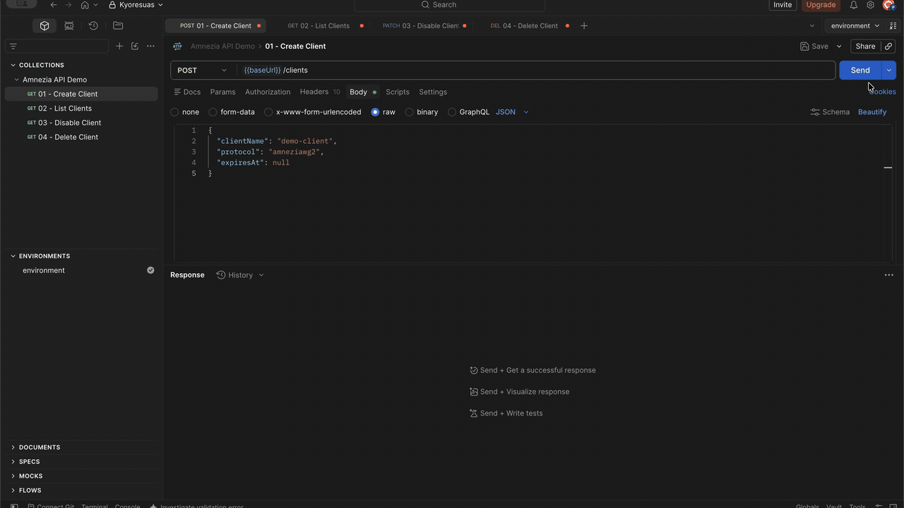
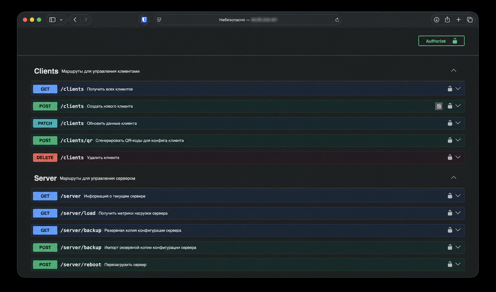

# Amnezia API

[](https://nodejs.org/)
[](https://fastify.dev/)
[](https://www.typescriptlang.org/)
[](https://github.com/kyoresuas/amnezia-api/actions/workflows/ci.yml)
[](https://github.com/kyoresuas/amnezia-api/pkgs/container/amnezia-api)
[](LICENSE)

**English** · [Русский](README_RU.md)

**A self-hosted REST API for automating Amnezia VPN servers.** Manage AmneziaWG, AmneziaWG 2.0, and Xray clients through one authenticated HTTP interface—with typed validation, Swagger UI, metrics, QR configs, expiration, and backups included.

Build an admin panel, Telegram bot, billing system, or multi-server control plane without manually SSH-ing into every VPN server.

[Quick start](#quick-start) · [API reference](#api-reference) · [Security](#security) · [Web panel](https://github.com/slowy19/amnezia-panel)



## Why Amnezia API?

Amnezia is excellent at deploying a private VPN. Amnezia API adds the automation layer needed when you manage more than a few users or servers.

| Capability | What it gives you |
| --- | --- |
| Unified protocol API | The same client workflow for AmneziaWG, AmneziaWG 2.0, and Xray |
| Client lifecycle | Create, list, update, disable, resume, and delete clients |
| Expiration | Automatically disable expired access without invalidating the client config |
| Ready-to-share configs | Return an Amnezia-compatible `vpn://` config and generate multi-part QR codes |
| Live visibility | Per-peer traffic, handshake, online status, endpoint, and allowed IPs |
| Server operations | CPU, RAM, disk, network, load, uptime, Docker stats, backup, restore, and reboot |
| Automation-ready metadata | Server ID, region, weight, and client limit for external routing and balancing |
| Developer experience | JSON Schema validation, localized responses, Swagger UI, and Prometheus metrics |

## How it fits

```text
Admin panel · Telegram bot · Billing · Automation
                       │
                 HTTPS + x-api-key
                       │
             Amnezia API (one per server)
                       │
           Existing Amnezia Docker containers
          AmneziaWG · AmneziaWG 2.0 · Xray
```

Already have a working Amnezia server? You do **not** need to reinstall its VPN protocols. The installer detects the existing `amnezia-awg`, `amnezia-awg2`, and `amnezia-xray` containers and configures the API around them. On first setup, Xray statistics support may update the Xray config and restart its container.

## Supported protocols

| Protocol | API value | Expected container |
| --- | --- | --- |
| AmneziaWG | `amneziawg` | `amnezia-awg` |
| AmneziaWG 2.0 | `amneziawg2` | `amnezia-awg2` |
| Xray | `xray` | `amnezia-xray` |

## Requirements

- A Linux server with at least one supported Amnezia protocol already installed.
- Root or `sudo` access for the guided installer.
- Debian or Ubuntu for automatic dependency installation.
- Docker with Compose for Docker mode, or Node.js 20+ for PM2 mode.

## Quick start

Clone the repository on the VPN server and run the guided installer:

```bash
git clone https://github.com/kyoresuas/amnezia-api.git
cd amnezia-api
bash ./scripts/setup.sh
```

The installer:

1. Detects the installed Amnezia protocols.
2. Generates a random API key and prepares `.env`.
3. Lets you choose Docker or PM2 mode.
4. Starts the API and configures Nginx on port `80`.
5. Enables Xray statistics when an `amnezia-xray` container is present.

After setup:

```text
API:     http://<server-ip>/
Swagger: http://<server-ip>/docs
Health:  http://<server-ip>/healthz
```

> [!IMPORTANT]
> The guided installer configures plain HTTP. Before exposing the API over the public internet, add TLS and restrict access at the firewall or reverse proxy. See [Security](#security).

### Docker Compose

For a manual Docker deployment with the prebuilt GHCR image:

```bash
git clone https://github.com/kyoresuas/amnezia-api.git
cd amnezia-api
cp .env.example .env
```

Generate a strong `FASTIFY_API_KEY`, place it in `.env`, verify the remaining values, then start the service:

```bash
openssl rand -hex 32
```

```bash
docker compose -f docker-compose.ghcr.yml up -d
docker compose ps
```

Set `AMNEZIA_API_VERSION` to a release such as `1.0.0` to pin the deployment. It defaults to `latest`.

To build the image locally from source instead:

```bash
docker compose up -d --build
```

Docker Compose binds the API to `127.0.0.1:4001`. Put a TLS-enabled reverse proxy in front of it when remote access is required.

### Updating

Run the installer again from the repository directory:

```bash
bash ./scripts/setup.sh
```

It performs a fast-forward update, detects the current Docker/PM2 mode, rebuilds the application, and preserves the existing `.env`.

## Releases and container images

Every `vX.Y.Z` release publishes a multi-platform image for `linux/amd64` and `linux/arm64`:

```bash
docker pull ghcr.io/kyoresuas/amnezia-api:latest
docker pull ghcr.io/kyoresuas/amnezia-api:1.0.0
```

Stable releases receive `latest`, major, minor, exact, and `v`-prefixed tags. Each image includes OCI metadata, an SBOM, and a GitHub provenance attestation. The corresponding GitHub Release includes generated release notes and the portable OpenAPI contract.

## Authentication

Protected routes require the API key in the `x-api-key` header:

```http
x-api-key: <FASTIFY_API_KEY>
```

`/healthz`, `/metrics`, and `/docs` are intentionally unauthenticated. Restrict `/metrics` and `/docs` at the reverse proxy if they should not be public.

## API reference



| Method | Route | Purpose |
| --- | --- | --- |
| `GET` | `/clients` | List clients with traffic and connection status |
| `POST` | `/clients` | Create a client and return an importable config |
| `PATCH` | `/clients` | Change status or expiration without rotating the config |
| `POST` | `/clients/qr` | Generate one or more Amnezia-compatible QR codes |
| `DELETE` | `/clients` | Delete a client |
| `GET` | `/server` | Return server identity, capacity, and enabled protocols |
| `GET` | `/server/load` | Return CPU, RAM, disk, network, and Docker metrics |
| `GET` | `/server/backup` | Export the server configuration |
| `POST` | `/server/backup` | Import a server configuration backup |
| `POST` | `/server/reboot` | Reboot the server |
| `GET` | `/healthz` | Health check |
| `GET` | `/metrics` | Prometheus metrics |

Swagger UI is available at `/docs` and contains the full request/response schemas, validation rules, and examples.

The versioned [OpenAPI 3.0 contract](openapi/openapi.json) can be downloaded without a running server and imported into Postman, Insomnia, API clients, or SDK generators. The same file is attached to every GitHub Release.

### Create a client

```bash
curl -X POST "https://vpn.example.com/clients" \
  -H "x-api-key: <FASTIFY_API_KEY>" \
  -H "Content-Type: application/json" \
  -d '{
    "clientName": "demo-client",
    "protocol": "amneziawg2",
    "expiresAt": null
  }'
```

```json
{
  "message": "Client created",
  "client": {
    "id": "<client-id>",
    "config": "vpn://...",
    "protocol": "amneziawg2"
  }
}
```

### List clients

```bash
curl "https://vpn.example.com/clients?skip=0&limit=100" \
  -H "x-api-key: <FASTIFY_API_KEY>"
```

### Disable or resume a client

Disabling a client preserves its keys and config. Set `status` back to `active` to restore access.

```bash
curl -X PATCH "https://vpn.example.com/clients" \
  -H "x-api-key: <FASTIFY_API_KEY>" \
  -H "Content-Type: application/json" \
  -d '{
    "clientId": "<client-id>",
    "protocol": "amneziawg2",
    "status": "disabled",
    "expiresAt": null
  }'
```

## Configuration

The installer creates `.env` from `.env.example` and fills the most important values automatically.

| Variable | Description |
| --- | --- |
| `FASTIFY_ROUTES` | Fastify bind address in `host:port` format |
| `FASTIFY_API_KEY` | Secret expected in the `x-api-key` header; minimum 32 characters |
| `CORS_ORIGINS` | Comma-separated browser origins; CORS is disabled when empty |
| `PROTOCOLS_ENABLED` | Comma-separated list: `amneziawg,amneziawg2,xray` |
| `SERVER_ID` | Stable unique server identifier |
| `SERVER_NAME` | Human-readable server name |
| `SERVER_REGION` | Region, availability zone, or custom label |
| `SERVER_WEIGHT` | Routing weight; the recommended range is `1..1000` |
| `SERVER_MAX_PEERS` | Maximum number of clients on this server |
| `SERVER_PUBLIC_HOST` | Public host or domain placed into generated endpoints |
| `DOCKER_GID` | Docker socket group ID used by Docker mode |
| `DOCKER_API_VERSION` | Docker Engine API version used by the bundled CLI |
| `AMNEZIA_API_VERSION` | GHCR image tag used by `docker-compose.ghcr.yml`; defaults to `latest` |

## Security

Amnezia API can modify VPN configuration and control Amnezia containers. Treat it as privileged infrastructure software.

- Never expose the API key over plain HTTP outside a trusted private network.
- Terminate TLS with Nginx, Caddy, Traefik, or another trusted reverse proxy.
- Restrict inbound access by IP, private network, or VPN whenever possible.
- Rotate `FASTIFY_API_KEY` if it may have been exposed.
- Keep `CORS_ORIGINS` empty for server-to-server use. If a browser client is required, list only its exact `http://` or `https://` origins.
- Docker mode mounts `/var/run/docker.sock`; access to this socket is highly privileged. Run the API only on a trusted host and keep dependencies updated.
- `/docs` and `/metrics` do not require the API key by default. Protect them at the reverse proxy when appropriate.
- Do not publish real API keys, `vpn://` configs, QR codes, backups, or unredacted production responses in issues or screenshots.

The service uses constant-time API-key comparison, rate limiting, request validation, and security headers. These controls do not replace TLS, network isolation, or host hardening.

Report suspected vulnerabilities privately by following the instructions in [SECURITY.md](SECURITY.md). Do not open a public issue for a security report.

## Development

```bash
npm ci
npm run dev
```

Before submitting a change:

```bash
npm run lint
npm test
npm run build
npm run openapi:check
```

When routes or schemas change, regenerate the portable contract with `npm run openapi:generate`. CI runs lint, tests, build, and contract checks on Node.js 20, 22, and 24. See [CONTRIBUTING.md](CONTRIBUTING.md) for the full contribution workflow.

## Ecosystem

- [amnezia-panel](https://github.com/slowy19/amnezia-panel) — a web administration panel built on top of Amnezia API.

If you build an integration, bot, SDK, or panel using this API, open an issue or pull request to add it here.

## Project status and support

Bug reports and feature requests are welcome in [GitHub Issues](https://github.com/kyoresuas/amnezia-api/issues).

- Telegram: [@stercuss](https://t.me/stercuss)
- Email: [hey@kyoresuas.com](mailto:hey@kyoresuas.com)

## Disclaimer

This is an independent community project. It is not affiliated with, sponsored by, or officially endorsed by the Amnezia project.

## License

[MIT](LICENSE)
